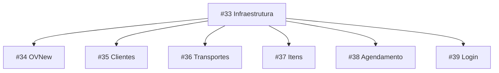

# PLAN — Migração de Formulários para React Hook Form + Zod

> Documento de planejamento. **Nenhuma implementação será feita antes da aprovação.**

---

## 1. Overview

Substituir os padrões atuais de formulário (FormData + `e.preventDefault()` + `safeParse` manual no submit, ou `useState` controlado) por **React Hook Form** com **zodResolver** em todas as páginas de formulário do XPTO.

### Formulários a migrar (6 páginas, 7 formulários)

| Página            | Padrão atual                              | Schema                         | Modo           |
| ----------------- | ----------------------------------------- | ------------------------------ | -------------- |
| `Clientes.tsx`    | FormData + `clienteSchema.safeParse()`    | `clienteFormSchema`            | Criar + Editar |
| `Transportes.tsx` | FormData + `transporteSchema.safeParse()` | `transporteFormSchema`         | Criar + Editar |
| `Itens.tsx`       | FormData + `itemSchema.safeParse()`       | `itemFormSchema`               | Criar apenas   |
| `Agendamento.tsx` | FormData + `validarJanela()` custom       | `agendamentoFormSchema` (novo) | Editar inline  |
| `Login.tsx`       | `useState` controlado                     | `loginFormSchema` (novo)       | Submit apenas  |
| `OVNew.tsx`       | RHF + `ovSchema.safeParse()` manual       | `ovFormSchema` (já existe)     | Criar          |

### O que muda

- **Antes**: `const fd = new FormData(e.currentTarget)` → objeto raw → `schema.safeParse(raw)` → erro manual
- **Depois**: `useForm<T>({ resolver: zodResolver(schema) })` → erros reativos campo a campo via `formState.errors`
- **Validação no submit**: RHF já valida tudo antes de chamar `onSubmit` — não precisa mais `safeParse` dentro do handler
- **Formatação de input** (máscara CPF/CNPJ, telefone): mantida via `onChange` ou `onBlur` nos registros
- **Botões de preenchimento rápido** (Login): mantidos via `setValue()` do RHF

### Dependências

| Pacote                    | Status              |
| ------------------------- | ------------------- |
| `react-hook-form@^7.81.0` | ✅ Já instalado     |
| `zod@^4.4.3`              | ✅ Já instalado     |
| `@hookform/resolvers`     | ❌ Precisa instalar |

---

## 2. Pré-requisitos (Ticket #33 — Infraestrutura)

**Nada pode começar sem este ticket.** Ele prepara o terreno para os 6 formulários.

### 2.1 Instalar `@hookform/resolvers`

```bash
npm install @hookform/resolvers
```

Verificar se o `zodResolver` exportado é compatível com Zod v4 (já instalado). O pacote `@hookform/resolvers` v3+ suporta Zod v3 e v4.

**Verificação pós-instalação:**

```ts
import { zodResolver } from '@hookform/resolvers/zod';
// Deve compilar sem erros
```

### 2.2 Criar `src/components/FormField.tsx`

Componente de boilerplate que reduz a repetição label + erro em todos os formulários. **API:**

```tsx
// FormField.tsx — API pública
import { type FieldError, type FieldErrors } from 'react-hook-form';

interface FormFieldProps {
  label: string;
  required?: boolean;
  error?: FieldError;
  children: React.ReactNode;
}

export function FormField({ label, required, error, children }: FormFieldProps) {
  return (
    <div className="space-y-1.5">
      <label className="text-[10px] font-bold text-text-faint uppercase tracking-widest block">
        {label}
        {required && <span className="text-amber-500"> *</span>}
      </label>
      {children}
      {error && (
        <p role="alert" className="text-rose-400 text-xs mt-1">
          {error.message}
        </p>
      )}
    </div>
  );
}
```

**Uso típico:**

```tsx
<FormField label="Nome" required error={errors.nome}>
  <input {...register('nome')} className="..." />
</FormField>
```

**Por que `error` é `FieldError | undefined` em vez de `FieldErrors<T>` + field name?** Porque o padrão `errors.nome` já resolve para `FieldError | undefined` no ponto de uso. O componente não precisa saber o nome do campo — só renderizar o `message` se existir. Isso mantém a API minimalista e o tipo mais simples.

**O componente deve ser colocado em `src/components/FormField.tsx`.**

### 2.3 Criar `src/schemas/agendamento.ts`

Schema Zod para agendamento (atualmente sem schema — usa `validarJanela()` função inline em `Agendamento.tsx`).

```ts
// src/schemas/agendamento.ts
import { z } from 'zod';

function parseJanela(val: string): { inicio: number; fim: number } | null {
  const match = val.match(/^(\d{2}):(\d{2})-(\d{2}):(\d{2})$/);
  if (!match) return null;
  const h1 = parseInt(match[1], 10),
    m1 = parseInt(match[2], 10);
  const h2 = parseInt(match[3], 10),
    m2 = parseInt(match[4], 10);
  if (h1 > 23 || m1 > 59 || h2 > 23 || m2 > 59) return null;
  const inicio = h1 * 60 + m1;
  const fim = h2 * 60 + m2;
  if (fim <= inicio) return null;
  return { inicio, fim };
}

// Super-refinement customizado para validar o formato HH:MM-HH:MM
const janelaSchema = z.string().refine(
  (val) => {
    if (!val) return true; // campo opcional
    return parseJanela(val) !== null;
  },
  { message: 'Formato inválido. Use HH:MM-HH:MM (ex: 08:00-12:00).' },
);

export const agendamentoFormSchema = z.object({
  dataEntrega: z.string().min(1, 'Informe a data de entrega'),
  janela: janelaSchema.optional().default(''),
});

export type AgendamentoInput = z.infer<typeof agendamentoFormSchema>;
```

**Registrar no barrel export** `src/schemas/index.ts`:

```ts
export { agendamentoFormSchema } from './agendamento';
export type { AgendamentoInput } from './agendamento';
```

**Registrar no re-export** `src/lib/validation.ts`:

```ts
import { agendamentoFormSchema } from '../schemas';
export const agendamentoSchema = agendamentoFormSchema;
```

### 2.4 Criar `src/schemas/login.ts`

Schema para login (email + senha).

```ts
// src/schemas/login.ts
import { z } from 'zod';

export const loginFormSchema = z.object({
  email: z.string().email('E-mail inválido'),
  senha: z.string().min(1, 'Senha é obrigatória'),
});

export type LoginInput = z.infer<typeof loginFormSchema>;
```

**Registrar no barrel** e re-export:

```ts
// schemas/index.ts
export { loginFormSchema } from './login';
export type { LoginInput } from './login';

// lib/validation.ts
import { loginFormSchema } from '../schemas';
export const loginSchema = loginFormSchema;
```

### 2.5 Verificação do ticket #33

```bash
npm run build   # tsc + vite build — deve passar limpo
```

---

## 3. Ordem de Implementação



**#33 primeiro.** Depois #34–#39 podem ser feitos em **qualquer ordem** (são independentes entre si).

---

## 4. Implementação Detalhada por Ticket

### 4.1 Ticket #34 — Refatorar OVNew

**Arquivo:** `src/pages/OVNew.tsx`

**Mudanças:**

1. Adicionar import do `zodResolver`
2. Mudar `useForm<FormData>` para usar `resolver: zodResolver(ovFormSchema)`
3. Remover validações inline `required: "msg"` dos registers — o schema já define isso
4. Remover `ovSchema.safeParse()` manual do `onSubmit`
5. Remover estado `serverError` (era usado para erro de parse do safeParse — agora o resolver já valida)

**Antes:**

```tsx
import { ovSchema } from "../lib/validation";

const { register, handleSubmit, control, watch, setError, clearErrors, setValue, formState: { errors } }
  = useForm<FormData>({
    defaultValues: { itens: [{ itemId: "", quantidade: 1 }] },
  });

// validação inline nos registers:
<input {...register("clienteId", { required: "Selecione um cliente" })} />

// safeParse manual no submit:
const onSubmit = async (data: FormData) => {
  const itensValidos = data.itens.filter((i) => i.itemId).length;
  if (itensValidos === 0) {
    setError("itens", { type: "manual", message: "Adicione ao menos um item" });
    return;
  }
  const parsed = ovSchema.safeParse(data);
  if (!parsed.success) { setServerError(parsed.error.issues[0].message); ... return; }
  // ... usa parsed.data
};
```

**Depois:**

```tsx
import { zodResolver } from '@hookform/resolvers/zod';
import { ovFormSchema } from '../schemas'; // note: ovFormSchema, não ovSchema

const {
  register,
  handleSubmit,
  control,
  watch,
  setValue,
  formState: { errors },
} = useForm<FormData>({
  resolver: zodResolver(ovFormSchema),
  defaultValues: { itens: [{ itemId: '', quantidade: 1 }] },
});

// registers sem validação inline:
<input {...register('clienteId')} />;

// onSubmit limpo — RHF já validou via resolver:
const onSubmit = async (data: FormData) => {
  // data já está 100% válido segundo ovFormSchema
  // Só precisa do check de itensValidos (filter + length) como lógica de negócio
  const itensValidos = data.itens.filter((i) => i.itemId).length;
  if (itensValidos === 0) {
    setError('itens', { type: 'manual', message: 'Adicione ao menos um item' });
    return;
  }
  clearErrors('itens');
  // ... prosseguir com data diretamente (não parsed.data)
};
```

**Detalhes importantes:**

- `ovSchema` vs `ovFormSchema`: O schema de validação do formulário é `ovFormSchema` (não `ovSchema` que inclui `id`, `numero`, etc.). **Mudar o import** de `ovSchema` para `ovFormSchema`.
- O `ovFormSchema` já tem `dataEntregaPrevista` com regex `^\d{4}-\d{2}-\d{2}$` — vai acusar erro se o usuário digitar data inválida.
- O `setError` para "itens vazios" permanece como validação manual (é lógica de negócio: o `ovFormSchema` exige `min(1)`, mas itens com `itemId = ""` passam no schema — o filtro de negócio remove esses).
- Remover o import de `ovSchema` de `../lib/validation` (pode deixar se ainda usado em outros lugares; nesse arquivo específico, substituir).
- Manter `clearErrors("itens")` no onSubmit após o filtro.

### 4.2 Ticket #35 — Refatorar Clientes

**Arquivo:** `src/pages/Clientes.tsx`

**Mudanças fundamentais:**

1. Trocar `handleSubmit` com FormData por `useForm<ClienteInput>` com `zodResolver(clienteFormSchema)`
2. Formatação de documento/telefone: antes era `onInput` mutando `e.currentTarget.value` — migrar para `onChange` do RHF
3. Lidar com o modal criar/editar: usar `reset()` para preencher valores na edição
4. Erro de submit (mutation) continua em estado local `erro` (erro de rede, não de validação)

**Antes (padrão FormData):**

```tsx
const handleSubmit = async (e: React.FormEvent<HTMLFormElement>) => {
  e.preventDefault();
  setErro("");
  const fd = new FormData(e.currentTarget);
  const raw = { nome: ..., documento: ..., etc };
  const parsed = clienteSchema.safeParse(raw);
  if (!parsed.success) { setErro(parsed.error.issues[0].message); return; }
  // mutation...
};
```

**Depois:**

```tsx
type FormValues = z.infer<typeof clienteFormSchema>;

// Hook state
const [editando, setEditando] = useState<Cliente | null>(null);
const [mostrarForm, setMostrarForm] = useState(false);
const [erro, setErro] = useState('');

const {
  register,
  handleSubmit,
  reset,
  formState: { errors },
} = useForm<FormValues>({
  resolver: zodResolver(clienteFormSchema),
  defaultValues: {
    nome: '',
    documento: '',
    email: '',
    telefone: '',
    endereco: '',
    ativo: true,
  },
});

// Reset do form ao abrir modal (novo ou edição)
const abrirForm = (cliente?: Cliente) => {
  setEditando(cliente ?? null);
  setErro('');
  if (cliente) {
    reset({
      nome: cliente.nome,
      documento: cliente.documento,
      email: cliente.email,
      telefone: cliente.telefone,
      endereco: cliente.endereco ?? '',
      ativo: cliente.ativo,
    });
  } else {
    reset(); // volta aos defaultValues
  }
  setMostrarForm(true);
};

const onSubmit = async (data: FormValues) => {
  setErro('');
  try {
    if (editando) {
      await atualizarCliente.mutateAsync({ id: editando.id, data });
    } else {
      await criarCliente.mutateAsync(data);
    }
    setEditando(null);
    setMostrarForm(false);
  } catch (err) {
    setErro(err instanceof Error ? err.message : 'Erro ao salvar');
  }
};

// Fechar modal
const fecharForm = () => {
  setMostrarForm(false);
  setEditando(null);
  setErro('');
  reset();
};
```

**Formatação de documento e telefone:**

A formatação visual (máscara) acontece **no onChange** — armazenamos o valor "limpo" (só dígitos) no estado do RHF, mas exibimos formatado.

```tsx
// Helper para formatar documento no display
function formatDocumentoDisplay(val: string): string {
  const d = val.replace(/\D/g, '');
  if (d.length <= 11) return d.replace(/(\d{3})(\d{3})(\d{3})(\d{2})/, '$1.$2.$3-$4');
  return d.replace(/(\d{2})(\d{3})(\d{3})(\d{4})(\d{2})/, '$1.$2.$3/$4-$5');
}
```

**Opção A — Controlled input via `useController`** (recomendada para formatações complexas):

```tsx
import { useController } from 'react-hook-form';

const { field: docField } = useController({
  control,
  name: 'documento',
});

// No input:
<input
  value={formatDocumentoDisplay(docField.value)}
  onChange={(e) => {
    const raw = e.target.value.replace(/\D/g, '');
    docField.onChange(raw); // store only digits
  }}
/>;
```

**Opção B — Uncontrolled com `onChange` no register** (mais simples, suficiente para este caso):

```tsx
<input
  {...register('documento')}
  onChange={(e) => {
    const raw = e.target.value.replace(/\D/g, '');
    e.target.value = formatDocumentoDisplay(raw);
    register('documento').onChange({ target: { value: raw } }); // ❌ complexo, não recomendado
  }}
/>
```

**Recomendação: Opção A** — `useController` para documento e telefone (campos com máscara), `register` simples para os demais.

**Template do form com RHF + FormField:**

```tsx
<form key={editando?.id ?? 'new'} onSubmit={handleSubmit(onSubmit)} className="flex flex-col gap-4">
  <div className="grid grid-cols-1 md:grid-cols-2 gap-4">
    <FormField label="Nome" required error={errors.nome}>
      <input
        {...register('nome')}
        className="w-full bg-input-bg border border-border text-text text-xs rounded-lg px-3 py-2.5 focus:ring-2 focus:ring-accent focus:border-transparent outline-hidden"
      />
    </FormField>
    <FormField label="Documento" required error={errors.documento}>
      <input
        {...docField}
        value={formatDocumentoDisplay(docField.value)}
        onChange={(e) => {
          const raw = e.target.value.replace(/\D/g, '');
          docField.onChange(raw);
        }}
        className="w-full bg-input-bg border border-border text-text text-xs rounded-lg px-3 py-2.5 focus:ring-2 focus:ring-accent focus:border-transparent outline-hidden"
      />
    </FormField>
    <FormField label="Email" required error={errors.email}>
      <input type="email" {...register('email')} className="..." />
    </FormField>
    <FormField label="Telefone" error={errors.telefone}>
      {/* similar ao documento, com useController */}
    </FormField>
  </div>
  <FormField label="Endereço" error={errors.endereco}>
    <input {...register('endereco')} className="..." />
  </FormField>
  <FormField label="Ativo" error={errors.ativo}>
    <select {...register('ativo')} className="...">
      <option value="true">Sim</option>
      <option value="false">Não</option>
    </select>
  </FormField>
  {erro && (
    <p role="alert" className="text-rose-400 text-xs">
      {erro}
    </p>
  )}
  {/* buttons */}
</form>
```

**Atenção:** O campo `ativo` é `z.boolean()`. O RHF envia string do `<select>` (`"true"` / `"false"`). O zodResolver vai rejeitar porque espera boolean. Duas opções:

1. **Usar controlled** com `useController` e fazer `onChange` converter string → boolean
2. **Converter no schema** adicionando `.transform()` — mas isso muda o schema para todos
3. **Usar `setValueAs`** no register:

```tsx
<select {...register("ativo", { setValueAs: (v) => v === "true" })}>
```

Opção #3 é a mais limpa — não polui o schema e não precisa de controller.

**Mesmo padrão se aplica a Transportes e Itens** que também têm campo `ativo`.

### 4.3 Ticket #36 — Refatorar Transportes

**Arquivo:** `src/pages/Transportes.tsx`

**Padrão idêntico ao Clientes**, mas mais simples (só 3 campos: `nome`, `modal`, `ativo`).

**Mudanças:**

1. Substituir FormData por `useForm<TransporteInput>` com `zodResolver(transporteFormSchema)`
2. `reset()` na abertura do modal (novo/edição)
3. Campo `modal` é `z.enum(["rodoviario", "aereo", "maritimo", "ferroviario"])` — o `<select>` funciona direto com register (valores correspondem aos enum values)
4. Campo `ativo` usa `setValueAs` (mesmo padrão do Clientes)
5. Remover `transporteSchema` do import de `validation.ts` (ou manter se usado em outro lugar, mas migrar o handleSubmit)

**Template:**

```tsx
type TransporteFormValues = z.infer<typeof transporteFormSchema>;

const {
  register,
  handleSubmit,
  reset,
  formState: { errors },
} = useForm<TransporteFormValues>({
  resolver: zodResolver(transporteFormSchema),
  defaultValues: { nome: '', modal: 'rodoviario', ativo: true },
});

// abrirForm, onSubmit, fecharForm — mesmo padrão do Clientes
```

### 4.4 Ticket #37 — Refatorar Itens

**Arquivo:** `src/pages/Itens.tsx`

**Particularidades:**

1. Apenas **criação** (sem edição) — mais simples
2. Campo `preco` no HTML que mapeia para `precoUnitario` no schema (com transform `* 100`)

**Mudanças:**

1. `useForm<ItemInput>` com `zodResolver(itemFormSchema)`
2. Campo `precoUnitario` no schema espera `z.number()` — no HTML o input é `type="number"` com nome `preco`. **Mapear via register:**
   - Ou renomear o input name para `precoUnitario`
   - Ou usar `setValueAs` para converter string → number e o resolver faz o parse
3. Campo `ativo` com `setValueAs`

**Atenção ao `precoUnitario`:**

O schema `itemFormSchema` define:

```ts
precoUnitario: z.number().positive().transform(v => Math.round(v * 100)),
```

Mas o valor armazenado no banco é em centavos (inteiro). O input HTML exibe valor em reais (real). O schema já faz o transform.

Para o RHF, o valor que entra no campo deve ser **em reais** (número decimal), e o resolver aplica o transform.

```tsx
<input type="number" step="0.01" {...register('precoUnitario', { valueAsNumber: true })} />
```

`valueAsNumber: true` faz o RHF converter a string do input para `number`. O `zodResolver` então roda `z.number().positive().transform(v => Math.round(v * 100))`.

**O que o submit recebe:** `precoUnitario` já em centavos (inteiro). Perfeito.

### 4.5 Ticket #38 — Refatorar Agendamento

**Arquivo:** `src/pages/Agendamento.tsx`

**Particularidades:**

- **Múltiplos formulários** na mesma página (um card por OV, cada um com seu form)
- Cada form precisa de seu próprio `useForm` — mas como só um pode estar em edição por vez (controlado por `editando` state), pode-se usar **um único `useForm`** e resetar com os valores da OV ao abrir edição
- Validação de janela (`HH:MM-HH:MM`) agora é feita pelo `zodResolver` com `agendamentoFormSchema`

**Mudanças:**

1. Criar `useForm<AgendamentoInput>` com `zodResolver(agendamentoFormSchema)`
2. Ao clicar "Agendar/Reagendar" em uma OV, chamar `reset()` com os valores atuais
3. Substituir `handleSalvar` (que recebia `form: HTMLFormElement`) por `handleSubmit` do RHF
4. Remover `validarJanela()` e `setJanelaErro` — erros agora vêm de `errors.janela`

**Antes:**

```tsx
const [janelaErro, setJanelaErro] = useState('');

const handleSalvar = async (ov, form) => {
  const fd = new FormData(form);
  const dataEntregaPrevista = fd.get('dataEntrega') as string;
  const janelaAtendimento = fd.get('janela') as string;
  const erro = validarJanela(janelaAtendimento);
  if (erro) {
    setJanelaErro(erro);
    return;
  }
  // mutation...
};
```

**Depois:**

```tsx
type AgendamentoFormValues = z.infer<typeof agendamentoFormSchema>;

const { register, handleSubmit, reset, formState: { errors } } = useForm<AgendamentoFormValues>({
  resolver: zodResolver(agendamentoFormSchema),
  defaultValues: { dataEntrega: "", janela: "" },
});

const abrirEdicao = (ov: OrdemVenda) => {
  setEditando(ov.id);
  setJanelaErro("");
  reset({
    dataEntrega: ov.dataEntregaPrevista?.split("T")[0] ?? "",
    janela: ov.janelaAtendimento ?? "",
  });
};

const onSubmitForm = async (data: AgendamentoFormValues) => {
  // data já está validado pelo zodResolver
  // data.dataEntrega = "2026-12-31", data.janela = "08:00-12:00"
  const ov = agendaveis.find((o) => o.id === editando);
  if (!ov) return;

  const body: Record<string, string> = {};
  if (data.dataEntrega) body.dataEntregaPrevista = new Date(data.dataEntrega).toISOString();
  if (data.janela) body.janelaAtendimento = data.janela;
  if (ov.status === "PLANEJADA") body.status = "AGENDADA";

  try {
    await atualizarOV.mutateAsync({ id: ov.id, data: body });
    trackEvent("ov:agendar", "ordem_venda", { ovId: ov.id, ... });
    setEditando(null);
    toast.success("Agendamento salvo com sucesso.");
  } catch (err) {
    toast.error(err instanceof Error ? err.message : "Erro ao salvar agendamento");
  }
};

// No JSX:
{editandoAgora ? (
  <form onSubmit={handleSubmit(onSubmitForm)} className="space-y-3">
    <FormField label="Data" required error={errors.dataEntrega}>
      <input type="date" {...register("dataEntrega")} className="..." />
    </FormField>
    <FormField label="Janela" error={errors.janela}>
      <input
        type="text"
        placeholder="ex: 08:00-12:00"
        {...register("janela")}
        className="..."
      />
    </FormField>
    {/* buttons */}
  </form>
) : (...)}
```

### 4.6 Ticket #39 — Refatorar Login

**Arquivo:** `src/pages/Login.tsx`

**Particularidades:**

- Formulário simples: email + senha
- Botões de preenchimento rápido que usam `setValue`
- Validação feita pelo schema (`email` valida formato, `senha` valida não-vazio)
- Submit chama `login()` do authStore (não mutation)

**Antes:**

```tsx
const [email, setEmail] = useState("");
const [senha, setSenha] = useState("");
const [erro, setErro] = useState("");

// botão de preenchimento:
onClick={() => { setEmail("admin@XPTO.local"); setSenha("admin123"); }}
```

**Depois:**

```tsx
import { zodResolver } from '@hookform/resolvers/zod';
import { loginSchema } from '../lib/validation';
import type { LoginInput } from '../schemas';

const {
  register,
  handleSubmit,
  setValue,
  formState: { errors },
} = useForm<LoginInput>({
  resolver: zodResolver(loginSchema),
  defaultValues: { email: '', senha: '' },
});

const [erro, setErro] = useState('');

const onSubmit = (data: LoginInput) => {
  setErro('');
  const msg = login(data.email, data.senha);
  if (msg) {
    setErro(msg);
  } else {
    navigate('/');
  }
};

// Botões de preenchimento rápido:
<button
  onClick={() => {
    setValue('email', 'admin@XPTO.local');
    setValue('senha', 'admin123');
    setErro('');
  }}
>
  admin@XPTO.local / admin123 (Admin)
</button>;
```

**Não esquecer** de remover os `useState` de `email` e `senha` (agora gerenciados pelo RHF).

---

## 5. Padrões e Decisões Transversais

### 5.1 `ativo` — string "true"/"false" → boolean

O `<select name="ativo">` envia string. O RHF com zodResolver vai falhar se o schema espera `z.boolean()`. Solução: **`setValueAs`** no register.

```tsx
<select {...register("ativo", { setValueAs: (v: string) => v === "true" })}>
```

Isso se aplica a: Clientes, Transportes, Itens.

### 5.2 `reset()` no modal criar/editar

Ao abrir modal para **edição**, chamar `reset(cliente)` com os valores existentes. Para **novo**, chamar `reset()` (volta aos defaultValues). Usar `key={editando?.id ?? "new"}` no `<form>` para forçar re-montagem se necessário (RHF gerencia estado interno — reset é suficiente).

### 5.3 Erro de servidor vs erro de validação

- **Erro de validação** (campo inválido): gerenciado pelo RHF via `errors.nome.message` → renderizado pelo `FormField`
- **Erro de servidor** (mutation rejeitada, rede, etc): estado local `erro` (ou `serverError`), exibido como bloco no topo do form

Manter a variável `erro`/`serverError` + `<p role="alert">` para erros de servidor. **Não** misturar com `setError` do RHF (que é para erros de campo).

### 5.4 FormField opcional mas não obrigatório

O `FormField` reduz boilerplate mas não precisa ser usado em todos os formulários se o layout exigir personalização. Pode-se usar o padrão manual (label + children + erro condicional) onde fizer mais sentido.

### 5.5 `formState: { errors }` — desestruturação

Sempre desestruturar `formState: { errors }` do `useForm()`. Isso cria um objeto reativo que reflete os erros atuais.

### 5.6 Zod v4 compatibilidade

Zod v4 está instalado. O `@hookform/resolvers` v3+ funciona com Zod v4. O `z.object`, `z.string`, `z.number`, `.min()`, `.max()`, `.email()`, `.regex()`, `.refine()`, `.transform()` — tudo compatível.

### 5.7 `useForm` + `control` só quando necessário

`control` só é necessário quando há `useFieldArray` ou `useController`. Se o formulário só usa `register`, não precisa desestruturar `control`.

---

## 6. Verificação

### 6.1 Para cada ticket

```bash
npm run build        # tsc + vite build — sem erros
npx vitest run       # testes unitários existentes continuam passando
npx playwright test  # testes E2E existentes continuam passando
```

### 6.2 Checklist de verificação manual

#### Ticket #33

- [ ] `@hookform/resolvers` no `package.json`
- [ ] `FormField` importável de `src/components/FormField`
- [ ] `agendamentoFormSchema` exportado de `src/schemas/agendamento`
- [ ] `loginFormSchema` exportado de `src/schemas/login`
- [ ] `npm run build` passa

#### Ticket #34 (OVNew)

- [ ] `useForm` usa `zodResolver(ovFormSchema)` ao invés de validação inline
- [ ] `onSubmit` recebe dados já validados — sem `safeParse` manual
- [ ] Erros de campo aparecem reativamente (ex: submit sem cliente → campo cliente fica vermelho)
- [ ] Teste E2E `e2e/ov-create.spec.ts` passa

#### Ticket #35 (Clientes)

- [ ] Formulário usa `useForm<ClienteInput>` com `zodResolver(clienteFormSchema)`
- [ ] Máscara de documento (CPF/CNPJ) funciona ao digitar
- [ ] Máscara de telefone funciona ao digitar
- [ ] Editar cliente pré-preenche o formulário corretamente
- [ ] Criar cliente funciona e aparece na lista
- [ ] Erros de campo aparecem reativamente

#### Ticket #36 (Transportes)

- [ ] Formulário usa `useForm<TransporteInput>` com `zodResolver(transporteFormSchema)`
- [ ] Criar/editar funcionam
- [ ] Erros aparecem reativamente

#### Ticket #37 (Itens)

- [ ] Formulário usa `useForm<ItemInput>` com `zodResolver(itemFormSchema)`
- [ ] Preço em reais → armazenado em centavos (ex: 10,50 → 1050)
- [ ] Criar item funciona

#### Ticket #38 (Agendamento)

- [ ] Formulário usa `useForm<AgendamentoInput>` com `zodResolver(agendamentoFormSchema)`
- [ ] Janela `08:00-12:00` → válido
- [ ] Janela `25:00-12:00` → erro
- [ ] Janela `12:00-08:00` → erro (fim > início)
- [ ] Data vazia → erro
- [ ] Agendamento/reagendamento persiste e atualiza card

#### Ticket #39 (Login)

- [ ] Formulário usa `useForm<LoginInput>` com `zodResolver(loginFormSchema)`
- [ ] Botões de preenchimento rápido preenchem campos
- [ ] Email inválido → erro reativo
- [ ] Senha vazia → erro reativo
- [ ] Credenciais corretas → login funciona

### 6.3 Testes E2E impactados

| Arquivo                       | Impacto                                                                                                                                                                                                 |
| ----------------------------- | ------------------------------------------------------------------------------------------------------------------------------------------------------------------------------------------------------- |
| `e2e/ov-create.spec.ts`       | Usa `select[name="clienteId"]`, `select[name="transporteId"]`, `input[name="dataEntregaPrevista"]`, `select[name="itens.0.itemId"]`, `input[name="itens.0.quantidade"]` — **todos preservados** com RHF |
| `e2e/rbac.spec.ts`            | Não mexe em formulários — **sem impacto**                                                                                                                                                               |
| `e2e/ov-list-filters.spec.ts` | Filtros de listagem — **sem impacto**                                                                                                                                                                   |
| `e2e/ov-detail.spec.ts`       | Detalhes da OV — **sem impacto**                                                                                                                                                                        |
| `e2e/cwv-audit.spec.ts`       | Métricas de performance — **sem impacto**                                                                                                                                                               |

**Nenhum teste E2E precisa ser alterado** — os `name` attributes dos inputs permanecem os mesmos (o RHF usa `register("nome")` que cria `<input name="nome">`).

---

## 7. Exemplo Completo: Padrão de Migração (Cliente como referência)

**Arquivo original:** `src/pages/Clientes.tsx` (283 linhas)

**Estrutura final esperada** (linhas que mudam):

```tsx
// IMPORTS — adicionar:
import { useForm } from 'react-hook-form';
import { zodResolver } from '@hookform/resolvers/zod';
import { clienteFormSchema } from '../schemas';
import type { ClienteInput } from '../lib/validation';
import { FormField } from '../components/FormField';

// STATE — remover:
// const [erro, setErro] = useState(""); ← mantém para erro de servidor

// HOOK:
const {
  register,
  handleSubmit,
  reset,
  control,
  formState: { errors },
} = useForm<ClienteInput>({
  resolver: zodResolver(clienteFormSchema),
  defaultValues: { nome: '', documento: '', email: '', telefone: '', endereco: '', ativo: true },
});

// FUNÇÃO DE ABRIR MODAL:
const abrirForm = (cliente?: Cliente) => {
  setEditando(cliente ?? null);
  setErro('');
  reset(cliente ?? undefined);
  setMostrarForm(true);
};

// HANDLE SUBMIT:
const onSubmit = async (data: ClienteInput) => {
  setErro('');
  try {
    if (editando) {
      await atualizarCliente.mutateAsync({ id: editando.id, data });
    } else {
      await criarCliente.mutateAsync(data);
    }
    setEditando(null);
    setMostrarForm(false);
  } catch (err) {
    setErro(err instanceof Error ? err.message : 'Erro ao salvar');
  }
};

// MODAL FORM — antes era:
// <form key={...} onSubmit={handleSubmit} className="...">
// Agora:
<form key={editando?.id ?? 'new'} onSubmit={handleSubmit(onSubmit)} className="flex flex-col gap-4">
  <FormField label="Nome" required error={errors.nome}>
    <input {...register('nome')} className="..." />
  </FormField>
  {/* ... */}
  {erro && (
    <p role="alert" className="text-rose-400 text-xs">
      {erro}
    </p>
  )}
</form>;

// ATUALIZAR BOTÕES DE ABRIR MODAL:
// Antes: onClick={() => { setMostrarForm(true); setEditando(null); setErro(""); }}
// Depois: onClick={() => abrirForm()}
//
// Antes: onClick={() => { setEditando(c); setMostrarForm(true); setErro(""); }}
// Depois: onClick={() => abrirForm(c)}
```

---

## 8. Resumo de Arquivos por Ticket

| Ticket | Arquivos criados                                                                     | Arquivos modificados                                            |
| ------ | ------------------------------------------------------------------------------------ | --------------------------------------------------------------- |
| #33    | `src/components/FormField.tsx`, `src/schemas/agendamento.ts`, `src/schemas/login.ts` | `package.json`, `src/schemas/index.ts`, `src/lib/validation.ts` |
| #34    | —                                                                                    | `src/pages/OVNew.tsx`                                           |
| #35    | —                                                                                    | `src/pages/Clientes.tsx`                                        |
| #36    | —                                                                                    | `src/pages/Transportes.tsx`                                     |
| #37    | —                                                                                    | `src/pages/Itens.tsx`                                           |
| #38    | —                                                                                    | `src/pages/Agendamento.tsx`                                     |
| #39    | —                                                                                    | `src/pages/Login.tsx`                                           |

---

## 9. Open Questions

1. **FormField opcional?** O componente reduz boilerplate mas pode ser ignorado onde o layout for complexo.
2. **Zod v4 + @hookform/resolvers:** Confirmar compatibilidade na instalação (`npm install @hookform/resolvers` e testar build).
3. **setValueAs para `ativo`:** Confirmar que `setValueAs` funciona com `zodResolver` (RHF passa o valor transformado para o resolver).
4. **Cliente modal key:** Usar `key={editando?.id ?? "new"}` no form continua sendo uma boa prática para forçar unmount/remount se houver resquícios de estado nativo do form.

---

## 10. Plano de Rollback

Se algo quebrar após um ticket:

1. `git diff` para ver o que mudou
2. `git checkout -- src/pages/<arquivo>` para reverter o arquivo
3. Se o problema for no schema/componente compartilhado (#33): reverter o arquivo + `npm uninstall @hookform/resolvers`
4. Rodar `npm run build` e `npx playwright test` para confirmar volta ao estado verde
